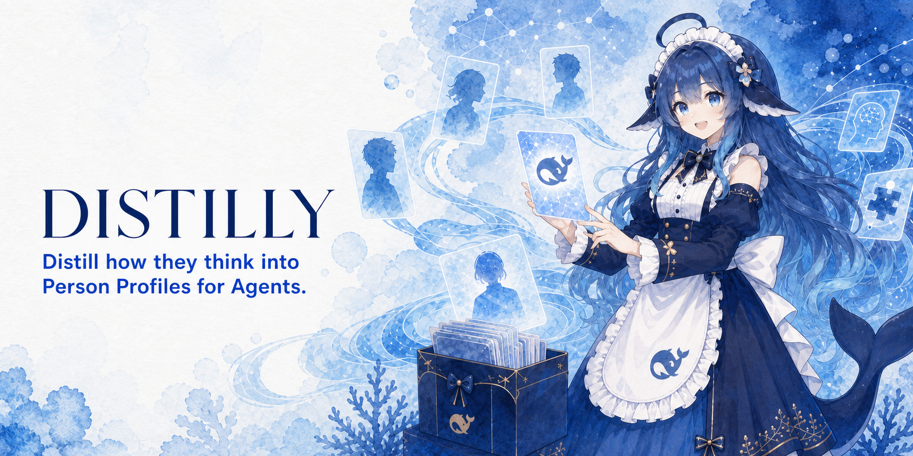
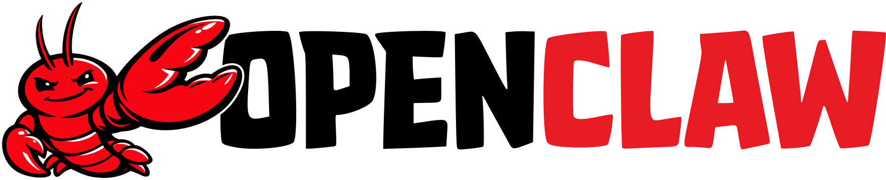

<div align="center">

# 🧬 Distilly

**Anteriormente: Colleague Skill / colleague-skill.**



### **Distill how they think.**

[](../../LICENSE)
[](https://python.org)
[](https://agentskills.io)
[](https://github.com/titanwings/distilly/stargazers)

[](https://discord.gg/NVX66RxWZv)

<br>

<table>
<tr><td align="left">

🧑‍💼 &nbsp;Seu colega pediu demissão, seu mentor se formou, seu parceiro de time foi transferido — levando junto todo o playbook e contexto?<br>
💞 &nbsp;Sua família, amigos antigos, seu parceiro(a) se distanciando — e você quer preservar o jeito que era estar com eles?<br>
🌟 &nbsp;Seu autor favorito, ídolo, pensador que você nunca vai conhecer — mas quer saber o que eles diriam sobre a sua pergunta?

</td></tr>
</table>

### ✨ Distilly transforma pessoas em Person Profiles reutilizáveis.

<br>

A Distilly transforma a experiência, o julgamento, a voz e as formas de trabalhar de uma pessoa, sustentados por fontes, em um Person Profile reutilizável por agentes de IA e bots compatíveis.

Colegas · parceiros · família · amigos antigos · ídolos · figuras públicas · personagens fictícios — até você mesmo

**Materiais de origem + sua descrição → um Person Profile baseado em evidências → seu Agent ou bot compatível**

<br>

[🆕 Novidades](#-o-que-há-de-novo-nesta-grande-versão) · [📦 Fontes de dados](#-fontes-de-dados-suportadas) · [⚡ Instalação](#-instalação) · [🚀 Uso](#-uso) · [✨ Demo](#-demo) · [💬 Discord](https://discord.gg/NVX66RxWZv)

[**Inglês**](../../README.md) · [**Chinês**](README_ZH.md) · [**Espanhol**](README_ES.md) · [**Alemão**](README_DE.md) · [**Japonês**](README_JA.md) · [**Russo**](README_RU.md) · [**Coreano**](README_KO.md)

</div>

---

<div align="center">

### 🎉 Marco 2026.08.13 — **Distilly ultrapassou 20K ⭐!**

Um obrigado enorme a todos que deram estrela — seguiremos lançando, seguiremos destilando.

</div>

> 🧬 **Atualização 2026.08.24** — O nome do creator, o diretório e o ponto de entrada agora são **Distilly** de ponta a ponta. A descoberta local de Skills é compatível com Claude Code, Hermes, OpenClaw, Codex, DeepSeek Harness, Pi, Grok Build e OpenCode; o Grok Bot permanece separado como preview de saved Skills.

> 📝 **Atualização 2026.06.01** — **[O relatório técnico do COLLEAGUE.SKILL](https://arxiv.org/pdf/2605.31264) já está disponível**; o que mais nos deixa felizes não é apenas publicar um paper, mas ver a comunidade levar a galeria a 215 skills de 165 contribuidores e 100k+ stars acumuladas em skill cards, com todos os contribuidores reconhecidos nos Acknowledgements.

> 🗺️ **2026.04.13** — **O Roadmap da Distilly está no ar!** O projeto que começou como colleague.skill agora se chama **Distilly** — destile qualquer pessoa, não apenas colegas. 👉 **[Roadmap completo](../../ROADMAP.md)** · **[💬 Discord](https://discord.gg/NVX66RxWZv)**

> 🌐 **2026.04.07** — A galeria comunitária está no ar! Qualquer skill ou meta-skill pode direcionar tráfego diretamente para o seu próprio repositório do GitHub. Sem intermediários. 👉 **[titanwings.github.io/colleague-skill-site](https://titanwings.github.io/colleague-skill-site/)**

<div align="center">

Criado por [@titanwings](https://github.com/titanwings)

</div>

---

## 🆕 O que há de novo nesta grande versão?

### 1️⃣ De Colleague Skill para Distilly

A Distilly não é mais construída apenas em torno do cenário de “colega”. O creator `distilly` cria Person Profiles baseados em fontes para três famílias de pessoas em um único fluxo e empacota cada Profile como Agent Skill. O nome canônico do Skill do creator e de seu diretório é `distilly`.

### 2️⃣ Três famílias de personagens

<table>
<thead>
<tr>
<th width="33%" align="center">🧑‍💼 colleague</th>
<th width="33%" align="center">💞 relationship</th>
<th width="33%" align="center">🌟 celebrity</th>
</tr>
</thead>
<tbody>
<tr>
<td align="center"><sub>Colegas de trabalho · mentores · parceiros de time · parceiros upstream/downstream</sub></td>
<td align="center"><sub>Ex-parceiros · parceiros atuais · pais · amigos · família próxima</sub></td>
<td align="center"><sub>Figuras públicas · criadores · vozes públicas · personagens fictícios</sub></td>
</tr>
<tr>
<td><sub>Arquitetura de duas camadas Work Skill + Persona — aprende tanto os padrões técnicos e workflows quanto o jeito de falar e a postura profissional. Suporta coleta automática em Lark / DingTalk / Slack.</sub></td>
<td><sub>🆕 <b>Recurso de compartilhamento de fotos em breve</b> — sua relação destilada não vai só responder mensagens; ela vai mandar fotos e compartilhar pedaços do dia, do jeito que uma pessoa real faria.</sub></td>
<td><sub>Vem com uma <b>cadeia de ferramentas de pesquisa em seis dimensões</b> completa (legendas → limpeza de transcrição → merge de pesquisa → checagem de qualidade). Não se limita a imitar o tom: reconstrói, com base nas fontes, padrões observáveis de raciocínio e decisão.</sub></td>
</tr>
</tbody>
</table>

Cada família tem sua própria estratégia de coleta de fontes, dimensões de análise e estrutura de Person Profile.

### 3️⃣ Mais hosts de Agent

A versão antiga rodava só no Claude Code. Agora oito hosts locais descobrem a Distilly nativamente pelo formato `SKILL.md`:

<table>
<tr>
<td align="center" width="25%"><a href="https://claude.ai/code"><picture><source media="(prefers-color-scheme: dark)" srcset="../assets/hosts/claude-code-wordmark-dark.svg"></picture></a></td>
<td align="center" width="25%"><a href="https://github.com/NousResearch/hermes-agent"></a></td>
<td align="center" width="25%"><a href="https://github.com/openclaw/openclaw"><picture><source media="(prefers-color-scheme: dark)" srcset="../assets/hosts/openclaw-wordmark-dark.svg"></picture></a></td>
<td align="center" width="25%"><a href="https://github.com/openai/codex" title="Codex"><picture><source media="(prefers-color-scheme: dark)" srcset="../assets/hosts/codex-mark-dark.png"></picture></a></td>
</tr>
<tr>
<td align="center" width="25%"><a href="https://github.com/deepseek-ai/deepseek-harness"><picture><source media="(prefers-color-scheme: dark)" srcset="../assets/hosts/deepseek-wordmark-dark.svg"></picture></a></td>
<td align="center" width="25%"><a href="https://pi.dev/docs/latest/skills"></a></td>
<td align="center" width="25%"><a href="https://docs.x.ai/build/features/skills-plugins-marketplaces"><picture><source media="(prefers-color-scheme: dark)" srcset="../assets/hosts/grok-build-mark-dark.png"></picture></a></td>
<td align="center" width="25%"><a href="https://opencode.ai/docs/skills"><picture><source media="(prefers-color-scheme: dark)" srcset="../assets/hosts/opencode-wordmark-dark.svg"></picture></a></td>
</tr>
</table>

Cada Person Profile gerado é empacotado como Agent Skill e pode ser colocado no diretório de Skills de cada host.

**Preview no Grok Bot:** migração manual como private saved skill. A instalação direta do `SKILL.md` deste repositório no Grok Bot não está documentada oficialmente nem foi verificada.

---

## 📦 Fontes de dados suportadas

| Fonte | Mensagens | Docs / Wiki | Planilhas | Notas |
|-------|:---------:|:-----------:|:---------:|-------|
| 🟢 Lark (auto) | ✅ API | ✅ | ✅ | Basta digitar um nome, totalmente automático |
| 🟡 DingTalk (auto) | ⚠️ Browser | ✅ | ✅ | A API do DingTalk não dá acesso ao histórico de mensagens |
| 🟣 Slack (auto) | ✅ API | — | — | Precisa que o admin instale o Bot; plano gratuito limitado a 90 dias |
| 𝕏 Posts públicos do X | ✅ API | — | — | Candidatos opcionais e limitados para pesquisa de celebrity via Xquik |
| 💬 Histórico do WeChat | ✅ SQLite | — | — | Exportar antes com WeChatMsg ou PyWxDump |
| 📄 PDF / Imagens / Screenshots | — | ✅ | — | Upload manual |
| 📦 Export JSON do Lark | ✅ | ✅ | — | Upload manual |
| ✉️ Email `.eml` / `.mbox` | ✅ | — | — | Upload manual |
| 📝 Markdown / colar direto | ✅ | ✅ | — | Entrada manual |

> **Nota de compatibilidade do Lark:** o coletor compatível atual usa os endpoints da região da China. O roteamento pelos endpoints internacionais de `larksuite.com` ainda não foi implementado.

---

## ⚡ Instalação

### 🤖 Para Agents

Abra um host local de Agent compatível e envie:

> Instale a Distilly a partir de https://github.com/titanwings/distilly e depois verifique se este host consegue detectá-la.

O Agent instalará o repositório no diretório de Skills correto do host com o nome `distilly`.

### 👤 Para pessoas

```bash
git clone https://github.com/titanwings/distilly <DISTILLY_SKILL_DIR>
```

Para ver os caminhos de cada host, migração, Windows, instalação de Profiles gerados e credenciais, consulte o **[guia detalhado de instalação (INSTALL_EN.md)](../../INSTALL_EN.md)**.

---

## 🚀 Uso

> Use a Distilly para criar um Person Profile de `<person>`.

1. Escolha `colleague`, `relationship` ou `celebrity`.
2. Forneça uma descrição ou materiais; todos os campos podem ser ignorados.
3. Revise o Person Profile e confirme a geração.

O resultado é empacotado como um Agent Skill chamado `{character}-{slug}`.

Consulte o **[guia detalhado de instalação (INSTALL_EN.md)](../../INSTALL_EN.md)** para pesquisa com `celebrity` e ferramentas avançadas.

---

## ✨ Demo

Um exemplo de cada família.

<br>

### 🌟 celebrity — destilando Andrej Karpathy

> Pesquisa em seis dimensões: obras · entrevistas · decisões · DNA de expressão · avaliações externas · linha do tempo<br>
> Caso adaptado do trabalho comunitário [alchaincyf/karpathy-skill](https://github.com/alchaincyf/karpathy-skill)

```
Usuário         ❯ Todo mundo tá falando de Agents agora — como você imagina o AI Agent de 2026?

celebrity.skill ❯ Todo mundo faz demo, ninguém faz eval.
                  O gargalo do Agent nunca foi a inteligência do modelo — é o scaffolding:
                  um harness de avaliação rigoroso, replay de erros com granularidade fina,
                  orçamentos controláveis de tool-calling, análise limpa de modos de falha.
                  A maioria dos produtos ainda tá presa em "envelopa uma API + algumas tools + um system prompt."
                  Isso é demo, não é agent.
                  Em 2026 eu não aposto no modelo mais forte — aposto no melhor
                  scaffolding e no eval mais rigoroso.
```

<br>

### 🧑‍💼 colleague — destilando um backend L2-1 da ByteDance

> Entrada: `engenheiro backend L2-1 da ByteDance, INTJ, empurra a responsabilidade, estilo ByteDance`

```
Usuário         ❯ Pode revisar esse design de API?

distilly ❯ Peraí — qual é o impacto? Você não explicou o contexto.
                  (depois de ler) Query N+1, corrige isso. Usa o formato
                  padrão de resposta {code, message, data}. Isso é convenção,
                  não pergunta por quê.

Usuário         ❯ Esse bug foi você que introduziu, né?

distilly ❯ A timeline bate? Essa feature mexeu em vários lugares,
                  teve outros commits também.
```

<br>

### 💞 relationship — destilando alguém por quem você tem uma queda

> Upload de meio ano de histórico de conversa + "sensível, quieto mas teimoso, responde de verdade quando é importante"

```
Usuário            ❯ Pensou em mim hoje?

relationship.skill ❯ ...pensei, um pouquinho. Por que tá perguntando?
```

<div align="center">

📚 Mais casos do mundo real na **[galeria comunitária](https://titanwings.github.io/colleague-skill-site/)** — mais de 100 skills e contando

</div>

---

## 🔧 Funcionalidades

### 🧱 Estrutura do Skill gerado

A Distilly usa **Persona** como a base universal, com módulos específicos de cada família em cima:

| Família | Conteúdo da Persona | Módulos Adicionais |
|---------|---------------------|---------------------|
| 🧑‍💼 **colleague** | Personalidade em 6 camadas: regras rígidas → identidade → expressão → decisões → interpessoal → Correção | ➕ **Work Skill**: escopo, workflow, preferências de output, base de conhecimento de experiência |
| 💞 **relationship** | DNA de expressão · gatilhos emocionais · padrão de conflito · padrão de reparo | — |
| 🌟 **celebrity** | Modelos mentais · heurísticas de decisão · DNA de expressão · contraste com avaliação externa | ➕ Dossiê de pesquisa em seis dimensões (obras / entrevistas / decisões / linha do tempo...) |

> **Execução**: Receber tarefa → Persona decide atitude e tom → Módulos adicionais preenchem o detalhe de execução → Output na voz dele

### 🧬 Evolução

- 📥 **Adicionar arquivos** → auto-análise de delta → merge nas seções relevantes, nunca sobrescreve conclusões existentes
- 💬 **Correção por conversa** → diga "ele não faria isso, ele seria xxx" → escreve na camada de Correção, efeito imediato
- 🕰️ **Controle de versão** → auto-arquivamento a cada atualização, rollback para qualquer versão anterior
- 🔬 **Pipeline de pesquisa de celebrity** → legendas → limpeza de transcrição → pesquisa em seis dimensões → checagem de qualidade

---

## ⚠️ Observações

**Qualidade do material fonte = Qualidade do Person Profile** — e as boas fontes variam conforme a família:

| Família | Prioridade de fontes (alta → baixa) |
|---------|-------------------------------------|
| 🧑‍💼 **colleague** | **Textos longos escritos pela própria pessoa** (docs de design / comentários de review) **›** **respostas de tomada de decisão** **›** chat casual em grupo |
| 💞 **relationship** | Histórico completo de conversa **›** cartas / posts em redes sociais / diários **›** descrições de terceiros |
| 🌟 **celebrity** | Fontes primárias longas (livros / blogs / entrevistas longas em primeira pessoa) **›** registros de decisão (lançamentos, commits, Q&A) **›** posts curtos verificados da pessoa-alvo **›** comentários de terceiros |

- **colleague** coleta automática do Lark: requer adicionar o bot do App aos grupos relevantes
- **relationship**: janelas de tempo mais longas são melhores; material cobrindo tanto conflito quanto reparo é ideal
- **celebrity**: evite alimentar só interpretações de segunda mão
- Esta ainda é uma versão demo — por favor crie issues se encontrar bugs!

---

## 📄 Relatório Técnico

> **[COLLEAGUE.SKILL: Automated AI Skill Generation via Expert Knowledge Distillation](https://arxiv.org/pdf/2605.31264)** ([arXiv](https://arxiv.org/abs/2605.31264) · [arXiv PDF](https://arxiv.org/pdf/2605.31264))
>
> Este é o paper do **colleague.skill**, antecessor da Distilly. Ele cobre a arquitetura de duas camadas Work Skill + Persona, coleta de dados multi-fonte e a mecânica de geração de Skills — a base teórica da família `colleague` atual. Papers separados sobre as extensões das famílias relationship / celebrity estão planejados.

---

## ⭐ Star History

<a href="https://star-history.dera.page/#titanwings/colleague-skill&type=date&legend=top-left">
 <picture>
   <source media="(prefers-color-scheme: dark)" srcset="https://star-history.dera.page/svg?repos=titanwings%2Fdistilly&type=date&theme=dark&legend=top-left" />
   <source media="(prefers-color-scheme: light)" srcset="https://star-history.dera.page/svg?repos=titanwings%2Fdistilly&type=date&legend=top-left" />
   
 </picture>
</a>

---

<div align="center">

**MIT License** © [titanwings](https://github.com/titanwings)

<sub>Feito com 🧬 para quem quer destilar uma pessoa em um Person Profile reutilizável.</sub>

</div>
